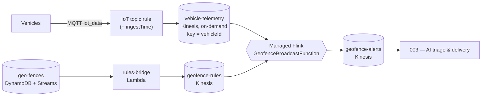
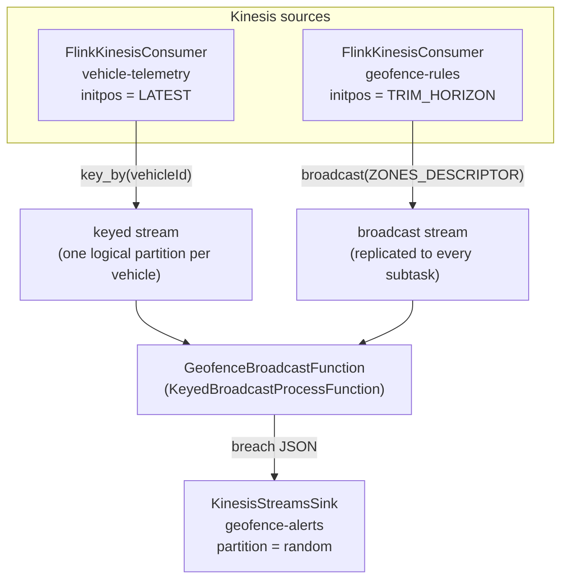
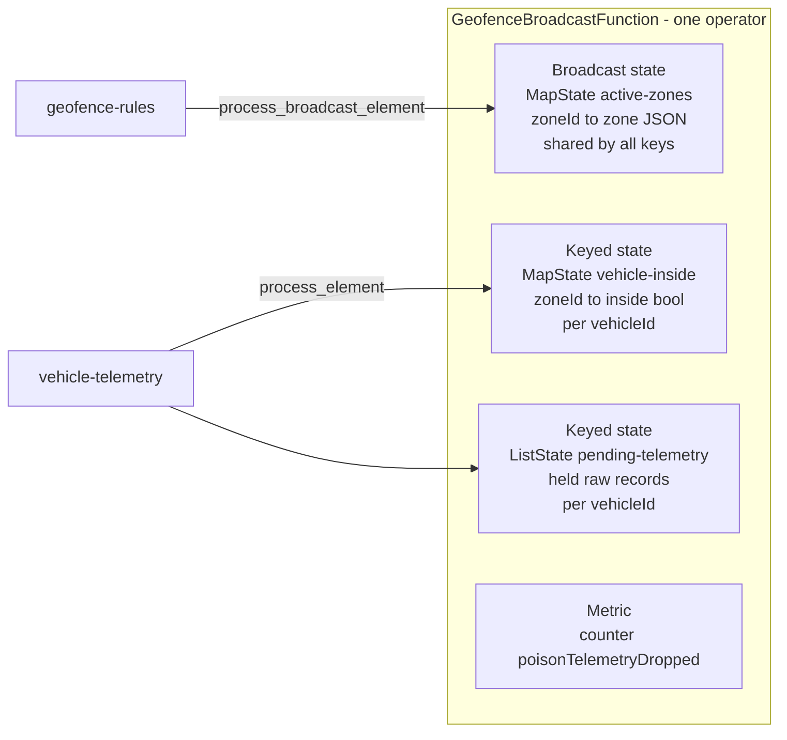
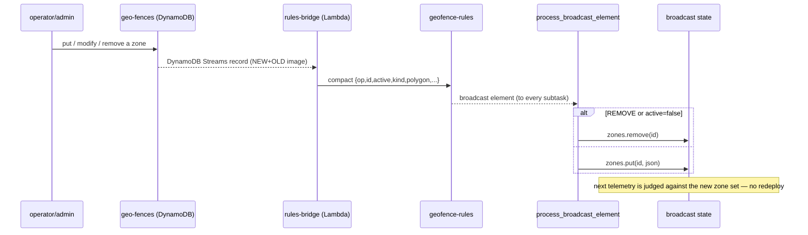
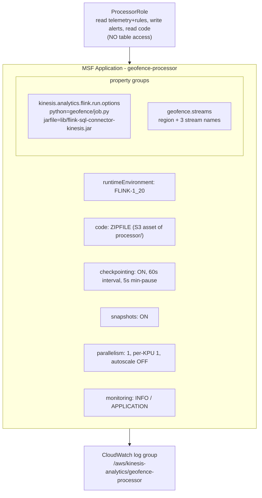
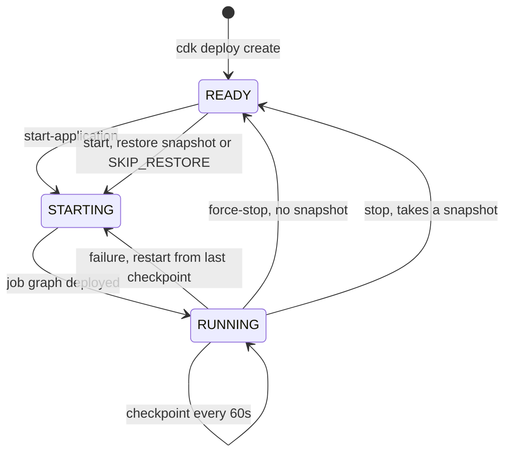

# Apache Flink in this project — how it's wired and why

This document explains how Apache Flink is used for real-time geofence breach
detection: the runtime, the dataflow topology, the state model, and — for each
characteristic the system needs — **which mechanism achieves it**. Diagrams are
Mermaid (they render on GitHub).

- **Runtime:** Amazon Managed Service for Apache Flink (MSF), `FLINK-1_20`
  (Apache Flink 1.20), **PyFlink** (Python DataStream API).
- **Job code:** `processor/geofence/` — `job.py` (the thin Flink adapter),
  `detector.py` / `geometry.py` / `edges.py` (the pure decision core), `latency.py`.
- **Infra (CDK):** `lib/processing-stack.ts` — the `AWS::KinesisAnalyticsV2::Application`
  plus its role, config, and log delivery.

---

## 1. Where Flink sits in the pipeline

Flink is the **stateful stream processor** between raw telemetry and the AI triage
layer. It turns a firehose of vehicle positions into a small stream of *factual*
breach events, evaluated against a set of geofences that can change live.



**Why Flink here (vs. a plain Lambda per record):** breach detection is inherently
**stateful** — a breach is a *boundary crossing*, so you must remember each vehicle's
previous inside/outside status; and every position must be tested against **all active
zones**, which themselves change over time. Flink gives us managed, checkpointed
keyed state and broadcast state for exactly these two needs, with exactly-once
guarantees. A Lambda would have to externalize all that state and lose ordering.

---

## 2. The Flink topology

`job.build_pipeline` wires two Kinesis sources into one `KeyedBroadcastProcessFunction`
and out to a Kinesis sink. Records are JSON strings end to end (`SimpleStringSchema`).



Source in `job.py`:

```python
keyed     = telemetry_stream.key_by(lambda r: json.loads(r)["vehicleId"])
broadcast = rules_stream.broadcast(ZONES_DESCRIPTOR)
keyed.connect(broadcast).process(GeofenceBroadcastFunction(), output_type=Types.STRING())
```

**Why `key_by(vehicleId)` + `broadcast(rules)`:** the two inputs have opposite
distribution needs. Per-vehicle transition state must always land on the *same*
subtask for a given vehicle → **keyed**. The zone set must be visible to *every*
subtask (any vehicle can be near any zone) → **broadcast**. `connect().process()` is
the one Flink primitive that joins a keyed stream with a broadcast stream.

---

## 3. The state model

The single operator holds three pieces of state. This is the heart of the design.



| State | Descriptor | Scope | Holds | Written by |
|-------|-----------|-------|-------|-----------|
| Active zones | `MapStateDescriptor("active-zones", STRING→STRING)` | **Broadcast** (all subtasks) | zoneId → the rule-change JSON (polygon, kind, active) | `process_broadcast_element` |
| Vehicle in/out | `MapStateDescriptor("vehicle-inside", STRING→BOOLEAN)` | **Keyed** (per vehicle) | zoneId → was-inside-last-time | `process_element` (via `_evaluate`) |
| Bootstrap buffer | `ListStateDescriptor("pending-telemetry", STRING)` | **Keyed** (per vehicle) | raw telemetry held until zones load | `process_element` |
| Poison counter | `counter("poisonTelemetryDropped")` | operator metric | count of dropped malformed records | `process_element` |

> **Note:** checkpointing, snapshots, and parallelism are **not** set in the job code —
> MSF rejects those in-code and configures them at the application level (§6). The job
> only declares state descriptors and logic.

---

## 4. Two event paths through the operator

### 4a. A telemetry position → zero or more breaches

```mermaid
sequenceDiagram
  participant T as telemetry record
  participant PE as process_element
  participant BS as broadcast state (zones)
  participant KS as keyed state (inside flags)
  participant OUT as geofence-alerts
  T->>PE: value (JSON string)
  PE->>PE: parse_telemetry(value)
  alt malformed (PoisonRecord)
    PE->>PE: poisonTelemetryDropped.inc(); return
  else valid
    PE->>BS: read active zones
    alt zones empty (bootstrap window)
      PE->>KS: pending.add(value); return
    else zones loaded
      PE->>KS: drain pending (replay in order)
      PE->>KS: prev_inside per active zone
      PE->>PE: evaluate_position(point-in-polygon vs ALL zones, edge detect)
      PE->>KS: update inside flags
      PE->>OUT: yield one breach per violating crossing
    end
  end
```

The decision itself is **pure** (`detector.evaluate_position`): for each active zone it
runs point-in-polygon (ray casting, `geometry.py`), compares to the vehicle's previous
inside flag to find an entry/exit *edge* (`edges.py`), and emits a breach only when the
crossing violates that zone's semantics.

### 4b. A rule change → broadcast-state update (no restart)



---

## 5. Characteristics → the mechanism that achieves each

This is the "what is achieved, in which way" summary.

| Characteristic / requirement | How it's achieved |
|---|---|
| **Test every position against all active zones** | **Broadcast state** (`active-zones` MapState) replicates the full zone set to every subtask; `evaluate_position` loops all zones per position. |
| **Live rule updates without a redeploy** | DynamoDB Streams on `geo-fences` → **rules-bridge Lambda** → `geofence-rules` Kinesis → **broadcast source**; `process_broadcast_element` mutates broadcast state in place. PyFlink has no DynamoDB-Streams connector, so the Lambda bridge is the seam. |
| **Per-vehicle ordering + stateful crossing detection** | **`key_by(vehicleId)`** routes a vehicle's records to one subtask; **keyed `vehicle-inside` MapState** remembers the last inside/outside per zone so `edges.detect_edge` can find a *crossing*, not just containment. |
| **Correct breach semantics per zone type** | `detector` maps zone `kind` → which crossing is a violation: exclusion = **entry** breach, containment = **exit** breach, dwell = **both**. Facts only — no severity/reason (that's the AI layer). |
| **Concave-polygon-correct geometry** | `geometry.point_in_polygon` uses **ray casting** (not a bounding box), correct for concave zones; `distance_to_boundary_m` gives "how far outside". |
| **Bootstrap safety (don't miss the first crossing)** | Rules source starts at **`TRIM_HORIZON`** so the zone set loads before telemetry is judged; belt-and-suspenders, the operator **holds** pre-rule telemetry in the `pending-telemetry` ListState and **replays** it once zones exist. |
| **Poison-record resilience** | `parse_telemetry` raises `PoisonRecord` for undecodable/invalid records; the operator **drops + counts** them (`poisonTelemetryDropped` metric) and keeps consuming — one bad record never stalls the shard. |
| **Fault tolerance (recover in-flight state)** | **Checkpointing** every 60 s (MSF app config) persists keyed + broadcast state; on failure Flink restarts from the last checkpoint. |
| **Exactly-once across updates & scaling** | **Snapshots** (`ApplicationSnapshotConfiguration` + restore) let the app stop/redeploy/rescale without losing or double-counting state. |
| **Latency observability** | The operator stamps `flinkRead`/`flinkEmit` into each breach's additive `trace` block (`latency.stamp_flink`); the offline probe computes per-hop deltas downstream (see `docs/…` 004). |
| **Testability without a cluster** | The Flink adapter is **thin**; all decision logic is in the pure `detector`/`geometry`/`edges` modules, unit-tested as a local mini-run and reproducible on a local MiniCluster. |

---

## 6. Managed Flink (MSF) configuration — `lib/processing-stack.ts`

The `AWS::KinesisAnalyticsV2::Application` resource carries all the operational config
that the job code intentionally does **not**:



Key points and the reasons behind them:

- **`run.options`** tell MSF the Python entry (`geofence/job.py`) and the connector
  **`jarfile`** to add to the classpath. MSF validates the jar exists *inside the zip*
  at create time — that's why the (git-ignored) jar must be fetched before deploy
  (`npm run fetch:connector`).
- **`geofence.streams` property group** injects region + stream names; `job.main`
  reads them from `/etc/flink/application_properties.json` (`_property_group`). No
  stream names are hard-coded for deploy.
- **Checkpointing / snapshots / parallelism live here, not in the job** — MSF rejects
  in-code checkpoint or parallelism config. Checkpoint = crash recovery; snapshot =
  safe updates/rescaling; parallelism 1 fits the ~2 msg/s pilot (autoscaling off to
  keep cost flat).
- **Least-privilege role:** the app can read `vehicle-telemetry` + `geofence-rules`,
  write `geofence-alerts`, and read its code asset — and deliberately has **no
  `geo-fences` table permission**, because it learns zones through the `geofence-rules`
  stream, not the table. Unused privilege omitted.
- **CloudWatch logging option** routes the job's logs to a real log group. (This was
  added after a deploy where the app failed silently back to READY with no logs.)
- **Deploy-ordering fix:** `flinkApp.node.addDependency(processorRole)` forces the app
  to be created only after the role's S3-read policy attaches — MSF validates code
  read at create time and would otherwise race the inline policy.

---

## 7. Connectors and the record format

| Direction | Connector | Config |
|---|---|---|
| Source × 2 | `FlinkKinesisConsumer` (legacy) | telemetry `initpos=LATEST`; rules `initpos=TRIM_HORIZON`; `aws.region` from props |
| Sink | `KinesisStreamsSink` (new FLIP-171 async sink) | `geofence-alerts`, `PartitionKeyGenerator.random()`, `SimpleStringSchema` |

- The bundled `flink-sql-connector-kinesis-5.1.0-1.20.jar` (matching `FLINK-1_20`)
  ships **both** APIs. The job uses the **legacy consumer** (stable PyFlink wrapper)
  for sources and the **new async sink** for output — `FlinkKinesisProducer` was
  removed from PyFlink 1.20, so the old producer is not an option.
- Everything on the wire is a **JSON string**; `SimpleStringSchema` avoids a schema
  registry and keeps the pure core operating on plain dicts.

---

## 8. Application lifecycle



MSF bills KPU-hours only while `RUNNING`, so the operational rule is: **stop the app
when idle** and tear it down between sessions.

---

## 9. Known limitation (live)

On Managed Flink the telemetry `FlinkKinesisConsumer` **under-read** during the live
run (it consumed a fraction of published records across restarts), so breaches did not
reach `geofence-alerts`. The **decision logic is proven correct** on a local Flink
MiniCluster (an outside→inside crossing produced the expected `entry` breach), so this
is a *managed-runtime source/connector* issue — candidate causes: `LATEST` starting
position losing records across restarts, or shard-discovery timing on the on-demand
stream. Next step is to reproduce the Kinesis source locally (or switch the sources to
the new FLIP-27 `KinesisStreamsSource`, also present in the jar) with task-level logs.
See `docs/live-deploy-findings.md` §7 and `DEPLOYMENT.md` §7.

---

## 10. File map

| Concern | File |
|---|---|
| Flink adapter (topology, state, `main`) | `processor/geofence/job.py` |
| Pure decision core (breach logic) | `processor/geofence/detector.py` |
| Point-in-polygon + distance | `processor/geofence/geometry.py` |
| Entry/exit edge detection | `processor/geofence/edges.py` |
| Latency trace stamping | `processor/geofence/latency.py` |
| Rule-change bridge (DDB Streams → Kinesis) | `lambda/rules_bridge/handler.py` |
| MSF application + role + logging (CDK) | `lib/processing-stack.ts` |
| Design rationale | `specs/002-processing/design.md` |
