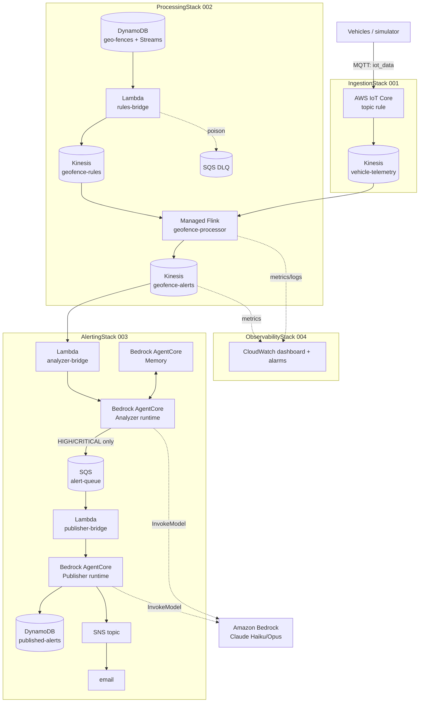
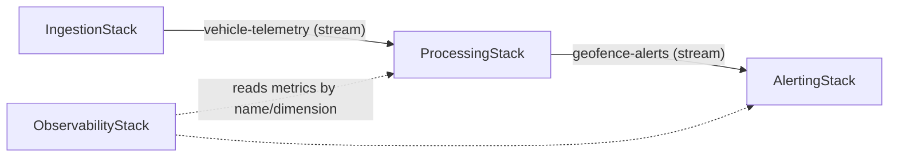

# Stacks & AWS services — what each part does

The system is four AWS CDK stacks. This doc explains **what each stack does**, **which
AWS services it uses**, and **how they connect**. For the Flink internals see
[`flink-architecture.md`](flink-architecture.md); for deploying see
[`../DEPLOYMENT.md`](../DEPLOYMENT.md).

| Stack | Increment | One-line purpose |
|-------|-----------|------------------|
| `IngestionStack` | 001 | Get vehicle telemetry off MQTT onto a durable, per-vehicle-ordered stream |
| `ProcessingStack` | 002 | Detect geofence breaches against live-editable zones |
| `AlertingStack` | 003 | AI-triage breaches, suppress noise, deliver actionable alerts |
| `ObservabilityStack` | 004 | Dashboard + alarms over the whole pipeline |

**Deploy order** (they cross-reference by CloudFormation export):
`IngestionStack → ProcessingStack → {ObservabilityStack, AlertingStack}`.

---

## System architecture (all services, end to end)

---

## IngestionStack (001) — telemetry ingestion

**Purpose:** route connected-vehicle messages from the MQTT topic onto a durable
Kinesis stream, partitioned per vehicle so each vehicle's records stay ordered.

**AWS services:** AWS IoT Core · Amazon Kinesis Data Streams · AWS IAM.

| Resource | Service | What it does |
|---|---|---|
| `vehicle-telemetry` | Kinesis Data Stream (on-demand) | durable, per-vehicle-ordered telemetry log |
| `VehicleTelemetryToKinesis` | IoT topic rule | `SELECT *, timestamp() AS ingestTime FROM 'iot_data'`, partition key `${vehicleId}` → Kinesis |
| `TelemetryRuleRole` | IAM role (trusts `iot.amazonaws.com`) | least-privilege: write to that one stream only |

**Why:** on-demand Kinesis auto-scales with the fleet (no shard management); the IoT
rule keys by `vehicleId` so downstream stateful processing gets ordered per-vehicle
records; `timestamp()` stamps the broker-ingest time for latency measurement (004).
Exports the stream so ProcessingStack can read it.

---

## ProcessingStack (002) — geofence breach detection

**Purpose:** hold the editable zone store and turn telemetry into *factual* breach
events, evaluated against zones that can change live without a redeploy.

**AWS services:** Amazon DynamoDB (+ Streams) · Amazon Kinesis Data Streams · AWS
Lambda · Amazon Managed Service for Apache Flink · Amazon SQS · Amazon S3 (code
asset) · Amazon CloudWatch Logs · CloudFormation custom resource · AWS IAM.

| Resource | Service | What it does |
|---|---|---|
| `geo-fences` | DynamoDB table (Streams: NEW+OLD images) | the zone store; change stream captures edits |
| `SeedZones` | CloudFormation custom resource (`batchWriteItem`) | seeds the four Calgary zones on deploy |
| `geofence-rules-bridge` | Lambda (Python) | maps DynamoDB-Streams zone edits → compact rule-change records |
| DynamoDB event source mapping | Lambda ESM | feeds the bridge; partial-batch + bisect + on-failure DLQ |
| `geofence-rules-bridge-dlq` | SQS queue | catches poison rule-change records |
| `geofence-rules` | Kinesis Data Stream | the live rule-change feed Flink reads as a broadcast source |
| `geofence-alerts` | Kinesis Data Stream | factual breach events out to the triage layer |
| `geofence-processor` | **Managed Service for Apache Flink** (FLINK-1_20, PyFlink) | the stateful breach detector — see `flink-architecture.md` |
| `ProcessorRole` | IAM role | read telemetry+rules, write alerts, read code — **no table access** |
| Processor code asset | S3 | the zipped PyFlink job + connector jar |
| Log group + logging option | CloudWatch Logs | Flink job logs |

**Why this shape:** PyFlink has no DynamoDB-Streams connector, so the **rules-bridge
Lambda** is the seam that turns table edits into a Kinesis stream Flink can broadcast.
DynamoDB Streams gives exactly-once, ordered change capture. Flink holds the zone set
as **broadcast state** and per-vehicle in/out flags as **keyed state**, with
checkpointing (60 s) and snapshots for fault tolerance. Exports `geo-fences` and both
streams for downstream stacks.

---

## AlertingStack (003) — agentic triage & delivery

**Purpose:** decide which breaches deserve a human, suppress the rest, and deliver the
survivors as context-rich alerts — the project's core "cut false alarms" bet.

**AWS services:** Amazon Bedrock AgentCore (Runtime + Memory) · Amazon Bedrock (model
inference) · Amazon ECR · AWS Lambda · Amazon SQS · Amazon SNS · Amazon DynamoDB ·
Amazon CloudWatch (alarms) · AWS IAM.

| Resource | Service | What it does |
|---|---|---|
| `geofence-analyzer-bridge` | Lambda | Kinesis ESM on `geofence-alerts` → `InvokeAgentRuntime`; partial-batch + DLQ |
| `geofence_alert_analyzer` | **Bedrock AgentCore Runtime** (container) | triages: act/suppress + severity; forwards only HIGH/CRITICAL |
| `geofence_vehicle_memory` | **Bedrock AgentCore Memory** | per-vehicle history (semantic + summary strategies) so repeats inform triage |
| Analyzer image | ECR (via CDK `DockerImageAsset`, ARM64) | the analyzer container |
| `geofence-alert-queue` (+ DLQ) | SQS | decouples analyzer → publisher; redrive to DLQ after 5 tries |
| `geofence-publisher-bridge` | Lambda | SQS ESM on the queue → `InvokeAgentRuntime` |
| `geofence_alert_publisher` | **Bedrock AgentCore Runtime** (container, no memory) | composes the four-section message + subject |
| Publisher image | ECR | the publisher container |
| `geofence-published-alerts` | DynamoDB (TTL) | idempotency ledger — claims a dedupe key so a breach is delivered **once** |
| `geofence-alerts-topic` (+ email sub, + sub DLQ) | SNS + SQS | delivery channel to the responder |
| 3 × depth alarms | CloudWatch | one per dead-letter queue |
| Analyzer/Publisher/Memory roles | IAM | invoke model (Bedrock), memory ops, SQS/SNS, ECR pull, logs/X-Ray |

**Why this shape:** AgentCore runtimes are *invoked*, not event-source-mapped, so two
thin **Lambda bridges** adapt Kinesis/SQS to `InvokeAgentRuntime`. The **suppression
gate** lives in the analyzer (only HIGH/CRITICAL reach SQS) — that's the H1 mechanism.
The **DynamoDB idempotency ledger** guarantees exactly-once delivery under at-least-once
streams. Model choice (Haiku for dev, Opus for demo) is an env var — no code change.
Every dead-letter queue has a depth alarm so nothing fails silently.

> The runtimes call **Amazon Bedrock** for inference; the account must have **model
> access** enabled (see `DEPLOYMENT.md §2`).

---

## ObservabilityStack (004) — dashboard & alarms

**Purpose:** answer "is each hop healthy?" and "where does latency accumulate?" across
the whole pipeline, and alarm on the streaming failure modes.

**AWS services:** Amazon CloudWatch (dashboard + alarms).

| Resource | Service | What it does |
|---|---|---|
| `geofence-pipeline` | CloudWatch dashboard | one row per hop (H1 IoT → H7 triage) + a stacked detection-vs-triage latency widget |
| 9 × alarms | CloudWatch alarms | iterator age (×2 streams), Flink `millisBehindLatest` / backpressure / failed-checkpoints / downtime, write-throughput canary, rules-bridge DLQ depth, detection-latency SLO |

**Why this shape:** it references metrics **by namespace/dimension** (not construct
references), so it deploys and tears down independently of the other stacks. A `SEARCH`
metric-math expression aggregates per-shard iterator age so it survives on-demand shard
churn. Metric set is on-demand-appropriate (consumer-lag/backpressure core;
throughput/utilization deferred to scale-time).

---

## AWS services matrix (which stack uses what)

| Service | 001 | 002 | 003 | 004 | Role in the system |
|---|:--:|:--:|:--:|:--:|---|
| AWS IoT Core | ✅ | | | | ingest MQTT → route to Kinesis |
| Kinesis Data Streams | ✅ | ✅ | | | telemetry, rules, alerts transport |
| DynamoDB (+ Streams) | | ✅ | ✅ | | zone store (+ change capture); idempotency ledger |
| AWS Lambda | | ✅ | ✅ | | rules bridge; two agent-invocation bridges |
| Managed Service for Apache Flink | | ✅ | | | stateful breach detection |
| Amazon SQS | | ✅ | ✅ | | DLQs; analyzer→publisher decoupling |
| Amazon SNS | | | ✅ | | alert delivery (email) |
| Bedrock AgentCore (Runtime + Memory) | | | ✅ | | the two agents + per-vehicle history |
| Amazon Bedrock (inference) | | | ✅ | | Claude Haiku/Opus for triage + composition |
| Amazon ECR | | | ✅ | | the two agent container images |
| Amazon S3 | | ✅ | | | Flink code asset (via CDK) |
| CloudWatch (Logs / Alarms / Dashboard) | | ✅ | ✅ | ✅ | logs, alarms, the pipeline dashboard |
| IAM | ✅ | ✅ | ✅ | ✅ | least-privilege roles throughout |

---

## Cross-stack contracts (the exports that wire them together)

- **001 → 002:** `vehicle-telemetry` stream (CloudFormation export → `ProcessingStack`
  reads it as the Flink telemetry source).
- **002 → 003:** `geofence-alerts` stream (export → `AlertingStack`'s analyzer bridge).
- **002 internal seam:** `geofence-rules` (documented so 003 does **not** depend on it).
- **004 → everything:** loose coupling — references metrics by namespace/dimension
  string, so no deploy-time dependency and independent teardown.

For per-increment detail: `specs/00N-*/{spec,design}.md`. For the Flink job specifically:
[`flink-architecture.md`](flink-architecture.md).
