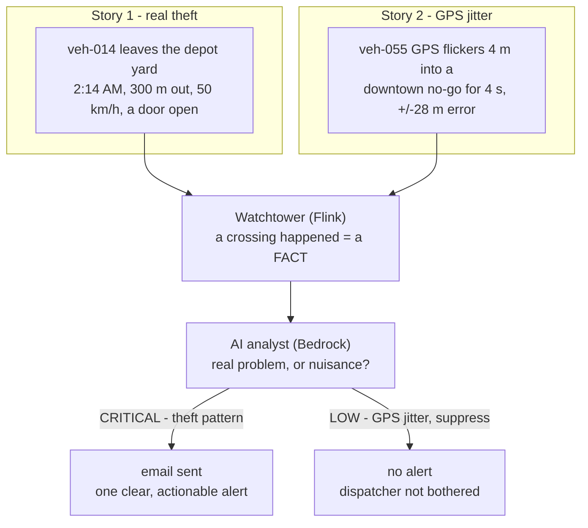

# What this project actually does (start here)

A plain-language overview — read this before the architecture docs.

## The problem, in one sentence

A company with a fleet of trucks draws virtual fences on a map ("geofences"), and wants
to know when a truck crosses one — **but most crossings are GPS glitches, not real
events**, so the dispatcher gets spammed, stops trusting the alerts, and eventually
misses the one that was a real theft. This project uses AI to **send only the alerts
that actually matter**, each written as a clear, actionable message.

## The virtual fences (three kinds)

Using the real Calgary zones the project ships with:

- 🚫 **No-go zone** (exclusion) — *Downtown Restricted Core*, *YYC airport airside*.
  A truck **entering** is the problem.
- 🔒 **Keep-in zone** (containment) — *Foothills Depot Yard*. A truck **leaving** is the
  problem (after hours = a theft signal).
- 📍 **Expected-stop** (dwell) — *North Job Site*. Arriving and leaving are **routine**,
  usually nothing.

## Two stories — this is the whole point

**Story 1 — a real theft (this SHOULD alert):**
> 2:14 AM. Truck `veh-014` is parked in the depot yard (a keep-in fence). Someone drives
> it out. The next GPS pings show it **300 m outside the yard, doing 50 km/h, engine on,
> a door was opened.**
>
> 1. The **watchtower** remembers the truck was *inside* last ping and is now *outside* →
>    that's an **exit crossing** of a keep-in zone → it reports a *factual* event:
>    `{veh-014, Foothills Depot, exit, 300 m out, door open}`. It says nothing about how
>    bad it is — just the facts.
> 2. The **AI analyst** reads it, checks the truck's history, and reasons: *"Left the
>    depot at 2 AM, sustained, moving fast, door opened — theft pattern."* → **CRITICAL.**
> 3. You get **one email**: *"[CRITICAL] veh-014 left Foothills Depot at 02:14, now 300 m
>    out at 50 km/h, door open — likely theft. Dispatch security."*

**Story 2 — a false alarm (this should STAY QUIET):**
> 3:20 PM downtown. Delivery van `veh-055` drives *past* a no-go zone. Its GPS flickers
> between skyscrapers — for **4 seconds** it reads **4 m inside** the zone, with a
> **±28 m** margin of error.
>
> 1. The watchtower sees an "entry crossing" → reports a factual event.
> 2. The **AI analyst** reads it: *"4 m inside, for 4 seconds, with 28 m of GPS error,
>    nothing else unusual — that's jitter bouncing off buildings, not a real incursion."*
>    → **suppressed. No email.**
>
> A dumb rule-based system pages the dispatcher here. This one doesn't. **That's the
> entire value** — kill the noise so the real theft in Story 1 doesn't get lost in it.

## Who's who (the AWS pieces, in plain English)

| Piece | Plain-English role |
|---|---|
| **AWS IoT Core** | the radio tower that receives every truck's GPS ping |
| **Kinesis** | a conveyor belt that records every ping, in order |
| **DynamoDB (geo-fences)** | the map of fences — editable live, no redeploy |
| **Managed Flink** | the **watchtower**: knows every fence + every truck's last spot, calls out crossings |
| **Bedrock AI (analyzer)** | the **experienced dispatcher**: "real problem, or nuisance?" |
| **AgentCore Memory** | the dispatcher's memory: "this truck did this yesterday too" |
| **Bedrock AI (publisher)** | writes the human-readable alert |
| **SNS → email** | delivers the alert to the on-call person |

## The one line to remember

**Raw crossings are cheap and noisy; a trustworthy alert is precious.** The whole
pipeline exists to turn a flood of "a truck touched a line" events into a trickle of
"here's a real thing to act on, and what to do." Geofence detection is the easy 20%;
the AI noise-filtering is the valuable 80% — and it's the bet the whole project is built
to prove.

## Where to go next

- **What each stack does + services used:** [`stacks.md`](stacks.md)
- **How the watchtower (Flink) works inside:** [`flink-architecture.md`](flink-architecture.md)
- **How to deploy and test it:** [`../DEPLOYMENT.md`](../DEPLOYMENT.md)
- **The product intent (requirements):** [`../PRD.md`](../PRD.md)
